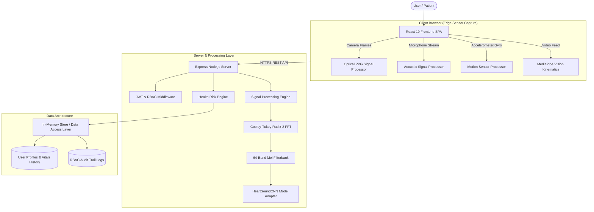

# SwasthAI: AI-Powered Non-Invasive Routine Health Screening Platform

[](LICENSE)
[](https://www.typescriptlang.org/)
[](https://react.dev/)
[](https://nodejs.org/)
[](https://vitejs.dev/)
[](https://tailwindcss.com/)

SwasthAI is an open-source, full-stack, software-based physiological health screening platform. It leverages standard consumer smartphone hardware (cameras, microphones, and motion sensors) to estimate routine physiological parameters—including heart rate (BPM), heart rate variability (HRV), proxy SpO2, phonocardiogram heart sound auscultation (`HeartSoundCNN`), respiratory cough acoustic patterns, and video pose/motion gait kinematics.

> **IMPORTANT CLINICAL DISCLAIMER**: SwasthAI is an academic research and software demonstration project designed strictly for routine personal wellness awareness and physiological signal processing exploration. It **DOES NOT** provide medical diagnosis, clinical evaluation, or treatment advice, and **DOES NOT** replace a licensed medical professional, stethoscope, electrocardiogram, or clinical diagnostic equipment.

---

## Overview

### What SwasthAI Solves
Access to routine cardiovascular, respiratory, and musculoskeletal health screening is often hindered by high equipment costs, geographical barriers, or lack of access to clinical facilities. SwasthAI demonstrates how pervasive consumer devices can capture multi-modal physiological signals non-invasively, providing accessible wellness insights and structured summary reports for clinician handoff.

### How the System Works
1. **Multi-Modal Signal Capture**: The user performs guided screenings using their smartphone camera (optical photoplethysmography), microphone (acoustic auscultation and cough recording), or video camera/motion sensors (kinematic gait tracking).
2. **In-Process Signal Processing**: High-performance digital signal processing (Cooley-Tukey Radix-2 FFT, 64-band Mel filterbank, 2nd-order Butterworth bandpass filtering, and pose landmark extraction) processes raw sensor feeds in real-time.
3. **Deep Learning & Kinematic Inference**: Extracted Mel-spectrograms are classified by an in-process `HeartSoundCNN` model to detect abnormal acoustic patterns (murmurs/arrhythmia), while MediaPipe landmark tracking computes step cadence and gait symmetry.
4. **Risk Aggregation & Clinical Handoff**: The multi-sensor `HealthRiskEngine` aggregates measurements against personalized baselines to assign a weighted risk score (0-100) and exportable PHI summary reports.

---

## Key Features

- 🫀 **Camera Fingertip PPG**: Real-time optical photoplethysmography extracting resting Heart Rate (BPM), HRV (RMSSD), and proxy SpO2 with Signal Quality Index (SQI) validation.
- 🩺 **Acoustic Phonocardiogram Auscultation**: Audio recording and spectrum analysis utilizing `HeartSoundCNN` to screen for periodic S1/S2 lub-dub rhythms versus acoustic murmur indicators.
- 🫁 **Respiratory Cough Screening**: Acoustic energy blast detection analyzing dry, wet, or wheezing cough frequency patterns.
- 🚶 **Dual-Modal Gait Assessment**:
  - **Motion Sensor Gait**: Tri-axial accelerometer/gyroscope vector cadence (spm) and stride regularity tracking.
  - **Camera Vision Gait**: MediaPipe 2D/3D pose landmark kinematics computing step cadence and step symmetry index.
- ⚖️ **BMI & Weight Tracker**: Body mass index computation with WHO reference category stratification.
- 🔄 **Automated Checkup Wizard**: Multi-module session orchestrator supporting daily, weekly, or comprehensive checkups.
- 📊 **Longitudinal Trends & Risk Engine**: Multi-sensor health risk score calculation with Recharts metrics history.
- 📄 **PDF & Text Report Generator**: Client-side/server-side summary report export for physician consults.
- 🛡️ **Role-Based Access Control (RBAC)**: Fine-grained permissions across Patient (`USER`), Operator, Admin, and Super Admin roles with audit logging.
- 🧪 **Interactive Simulation Engine**: Configurable demo scenarios for testing normal, monitor, follow-up, and low-quality signal conditions.

---

## System Architecture



---

## Application Workflow

```
[1. Sign In / Register] ──> [2. Complete Profile Demographics] ──> [3. Launch Checkup Session]
                                                                          │
    ┌─────────────────────────────────────────────────────────────────────┘
    ▼
[4. Module Screenings]
 ├── a. Camera PPG (Hold finger over rear lens for 20s)
 ├── b. Heart Auscultation (Place phone microphone against chest for 10s)
 ├── c. Cough Acoustics (Cough 3 times into microphone)
 └── d. Gait Kinematics (Perform 6-second walk test)
    │
    ▼
[5. Multi-Sensor Risk Evaluation] ──> [6. View Trends & Download Health Report]
```

---

## Technology Stack

| Layer | Technology |
| :--- | :--- |
| **Frontend** | React 19, TypeScript 5.8, Vite 6, Tailwind CSS v4, Lucide Icons, Framer Motion, Recharts, jsPDF |
| **Backend** | Node.js 18+, Express 4, esbuild, tsx |
| **AI / ML & Signal Processing** | PyTorch (Model Training), In-Process TypeScript `HeartSoundCNN` Inference, Cooley-Tukey FFT, Mel-Filterbank, MediaPipe Pose Kinematics |
| **Database / Storage** | In-Memory Data Store with JSON persistence abstraction, LocalStorage token management |
| **Security & Auth** | JWT Authentication, SHA-256 password hashing, RBAC Middleware, CORS |
| **Build & Testing** | Vite, esbuild, TypeScript Compiler (`tsc`), Custom End-to-End & Signal Processing Test Suites |
| **Deployment** | Render, Railway, Vercel, Docker (Single-binary Express CJS output) |

---

## Project Structure

```
swasthai/
├── .github/                  # CI/CD Workflows, PR & Issue Templates
│   ├── workflows/ci.yml
│   └── PULL_REQUEST_TEMPLATE.md
├── docs/                     # Comprehensive Project Documentation
│   ├── ARCHITECTURE.md       # Detailed System Architecture
│   ├── API.md                # Complete REST API Specification
│   ├── SETUP.md              # Local Setup & Troubleshooting
│   ├── DEPLOYMENT.md         # Cloud & Container Deployment Guide
│   ├── DATABASE.md           # Data Storage & PostgreSQL Schema
│   ├── ML.md                 # Signal Processing & HeartSoundCNN Specification
│   ├── SECURITY.md           # RBAC Permission Matrix & Security
│   └── CONTRIBUTING.md       # Developer Guidelines
├── gait_video/               # Video Pose Kinematics Pipeline
│   ├── production_pipeline/  # MediaPipe landmark extractor
│   └── synthetic_poc/        # Feature extraction modules
├── heart_model/              # Machine Learning Architecture & Models
│   ├── heart_sound_model.pt  # Model Spec Checkpoint File
│   ├── production_pipeline/  # PyTorch HeartSoundCNN (model, train, eval, dataset)
│   └── synthetic_poc/        # SciKit-Learn fallback pipeline
├── scripts/                  # Seed & Administrative Scripts
│   └── create_admin.py       # Idempotent admin account seeder
├── server/                   # Backend Express Engine & DSP Modules
│   ├── admin_seed.json       # Seed account credentials
│   ├── camera_gait.ts        # Vision landmark gait processor
│   ├── gait_service.ts       # Gait orchestration service
│   ├── heart_sound_ml.ts     # In-process Cooley-Tukey FFT & HeartSoundCNN Engine
│   ├── mock_store.ts         # Multi-user data store & session manager
│   ├── rbac.ts               # Role-based access control middleware
│   ├── risk_engine.ts        # HealthRiskEngine score aggregator
│   ├── signal_processing.ts  # Optical PPG, Acoustic & Motion DSP
│   ├── e2e_verification_test.ts # End-to-End System Test Suite
│   ├── heart_sound_test.ts   # HeartSoundCNN Model Test Suite
│   └── ppg_test.ts           # Optical PPG Signal Processor Test Suite
├── src/                      # Frontend React SPA Source Code
│   ├── components/           # UI Components (Header, Nav, Modals)
│   ├── screens/              # App Screens (Home, Checkup, Vitals, Admin, Reports)
│   ├── services/             # API Client & Web Sensor Adapters
│   ├── App.tsx               # Primary React App Component
│   ├── main.tsx              # React Vite Entrypoint
│   └── types.ts              # TypeScript Domain Contracts
├── .env.example              # Environment Configuration Template
├── .gitignore                # Git Ignore Rules
├── CHANGELOG.md              # Project Version History
├── CODE_OF_CONDUCT.md        # Contributor Covenant Code of Conduct
├── CONTRIBUTING.md           # Contribution Reference
├── LICENSE                   # MIT License
├── package.json              # Dependencies & NPM Scripts
├── server.ts                 # Main Express Application & Vite Middleware Entry Point
└── vite.config.ts            # Vite Configuration
```

---

## Prerequisites

- **Node.js**: `v18.0.0` or higher (Recommended: `v20.x`)
- **npm**: `v9.0.0` or higher
- **Git**: `2.30+`

---

## Installation & Local Setup

1. **Clone the repository**:
   ```bash
   git clone https://github.com/your-username/swasthai.git
   cd swasthai
   ```

2. **Install dependencies**:
   ```bash
   npm install
   ```

3. **Configure Environment Variables**:
   ```bash
   # On Linux / macOS
   cp .env.example .env

   # On Windows PowerShell
   Copy-Item .env.example .env
   ```

4. **Run the Development Server**:
   ```bash
   npm run dev
   ```
   Access the application at `http://localhost:3000`.

---

## Environment Variables

| Variable | Default Value | Description |
| :--- | :--- | :--- |
| `PORT` | `3000` | Application HTTP Port |
| `NODE_ENV` | `development` | Runtime environment (`development` / `production`) |
| `ML_MODE` | `real` | Machine learning mode (`real` or `demo`) |
| `HEART_SOUND_MODEL_PATH` | `heart_model/heart_sound_model.pt` | Path to HeartSoundCNN checkpoint |
| `HEART_SOUND_NORMAL_THRESHOLD` | `0.40` | Upper probability threshold for Normal classification |
| `HEART_SOUND_FOLLOW_UP_THRESHOLD` | `0.65` | Lower probability threshold for Follow-Up classification |
| `JWT_SECRET` | `swasthai_jwt_super_secret_key_2026_dev` | JWT signing secret |
| `ADMIN_EMAIL` | `admin@swasthai.com` | Default admin seed email |

See [.env.example](.env.example) for the complete list of configurable variables.

---

## Testing

SwasthAI includes 3 automated test suites verifying end-to-end APIs, ML model inference, and optical PPG signal processing:

```bash
# Run all verification test suites
npm test

# Run individual test suites
npm run test:e2e     # End-to-End System Verification
npm run test:heart   # HeartSoundCNN Model Inference
npm run test:ppg     # Optical PPG Signal Processor
```

---

## Production Build & Start

To build the static React bundle and compile the Express server for production:

```bash
# 1. Type-check TypeScript
npm run lint

# 2. Build Vite SPA & bundle Express server
npm run build

# 3. Start production server
npm start
```

---

## Key API Endpoints Summary

- **`GET /health`**: Healthcheck and system status.
- **`POST /api/auth/login`**: User authentication.
- **`POST /api/measurements/ppg`**: Camera fingertip PPG processing.
- **`POST /api/screening/heart-sound`**: Acoustic heart sound auscultation (`HeartSoundCNN`).
- **`POST /api/screening/cough`**: Respiratory acoustic screening.
- **`POST /api/screening/gait`**: Motion sensor gait analysis.
- **`POST /api/measurements/gait/camera`**: MediaPipe vision gait kinematics.
- **`GET /api/risk/summary`**: Multi-sensor health risk score aggregation.
- **`GET /api/reports/:id/download`**: Download clinical summary report.

See [docs/API.md](docs/API.md) for full endpoint specifications and request/response samples.

---

## Machine Learning Architecture (`HeartSoundCNN`)

The `HeartSoundCNN` model screens phonocardiogram (PCG) acoustic recordings for abnormal patterns.

- **Preprocessing**: Raw 2,000Hz audio is filtered (25Hz - 400Hz bandpass) and converted to a 64-band Mel-spectrogram across 128 time frames using an in-process Cooley-Tukey Radix-2 FFT.
- **Inference**: Evaluates acoustic energy distribution (S1/S2 clicks vs. high-frequency murmur plateaus).
- **Classification Output**: Returns `normal` or `abnormal_pattern` with a calibrated probability score (`0.00` to `1.00`).
- **PyTorch Training**: Complete model definition (`model.py`), dataset loader (`dataset.py`), and training script (`train.py`) are provided in `heart_model/production_pipeline/`.

---

## Deployment

SwasthAI can be deployed for free on cloud platforms:

- **Render**: Connect repository, set Build Command to `npm install && npm run build`, Start Command to `npm start`.
- **Railway / Vercel**: Fully supported out of the box with automatic Node server detection.
- **Docker**: Build container image using Node 20 alpine base.

See [docs/DEPLOYMENT.md](docs/DEPLOYMENT.md) for detailed platform deployment steps.

---

## Screenshots & Interface Layout

| Screen | Description |
| :--- | :--- |
| **Home Dashboard** | Vitals summary card, quick screening action launcher, and overall health status gauge. |
| **Camera PPG Screen** | Live camera video preview with real-time pulsatile waveform and signal quality indicator. |
| **Heart Sound Screen** | Acoustic auscultation recorder with frequency spectrum visualizer and `HeartSoundCNN` output. |
| **Health Summary Report** | PDF & TXT downloadable report with patient demographics, physiological estimates, and clinical disclaimers. |

---

## Known Limitations

- **Software Estimation**: Physiological metrics are proxy estimates derived from optical and acoustic consumer sensors and require adequate lighting and quiet environments.
- **In-Memory Storage**: Current data persistence uses an in-memory data store (`mock_store.ts`). Server restarts reset active user sessions unless migrated to PostgreSQL.
- **Cold Starts**: Free cloud hosting services (e.g., Render Free Tier) spin down after 15 minutes of inactivity, leading to a ~10-15s cold start delay on first load.

---

## License

This project is licensed under the **MIT License** - see the [LICENSE](LICENSE) file for details.
