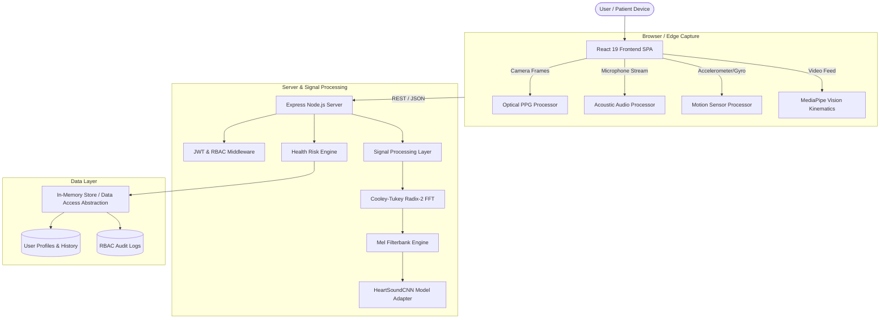

# SwasthAI Architecture & Technical Specification

## System Overview

SwasthAI is a non-invasive, routine physiological health screening platform that runs on consumer smartphone hardware (cameras, microphones, motion sensors) without requiring external hardware peripherals.

The system combines front-end optical and acoustic signal processing, in-process deep learning inference engines (`HeartSoundCNN`), video pose landmark kinematics, and an aggregated clinical Health Risk Engine.



---

## Component Architecture

### 1. Frontend Layer (`/src`)
- **Framework**: React 19 + TypeScript 5.8 + Vite 6.
- **Styling**: Tailwind CSS v4 with custom responsive layouts.
- **UI Components**:
  - `Header`: User profile badge, notification status, emergency access button.
  - `BottomNav`: Mobile tab navigation across Home, Checkups, Trends, Lab/Doctor, Reports.
  - `AuthModal`: User authentication modal supporting Login and Patient Registration.
  - `EmergencyModal`: Quick-access 108 emergency dialer and clinical disclaimers.
  - `ProfileSetupModal`: User demographic setup (Age, Sex, Height, Weight).
- **Screens**:
  - `HomeScreen`: Vitals summary card, quick action checkup launcher, risk assessment gauge.
  - `PPGScreen`: Real-time optical fingertip camera photoplethysmography capture with pulsatile waveform rendering.
  - `HeartSoundScreen`: Acoustic auscultation recording with frequency spectrum visualization and `HeartSoundCNN` inference trigger.
  - `CoughScreen`: Respiratory acoustic screening for cough explosive blast and wheeze pattern analysis.
  - `GaitScreen`: Dual-modal gait assessment (motion accelerometer/gyroscope gait + camera vision walk-in kinematics).
  - `BMIScreen`: Anthropometric body mass index tracker.
  - `CheckupFlow`: Multi-module automated screening session wizard.
  - `ReportsScreen`: PDF & text summary report generator (`jsPDF`).
  - `TrendsScreen`: Recharts longitudinal metrics history graphs.
  - `DoctorConsultScreen` & `LabBookingScreen`: Teleconsultation & lab booking partner interface.

### 2. Backend Layer (`/server` & `server.ts`)
- **Server Framework**: Node.js 18+ with Express 4.
- **Build Pipeline**: Bundled via `esbuild` to CJS (`dist/server.cjs`) for single-binary Node execution.
- **Modules**:
  - `server.ts`: Server bootstrap, Express middleware, Vite SPA handler, and API routing.
  - `server/mock_store.ts`: In-memory multi-user data store supporting user accounts, checkup sessions, reports, appointments, lab bookings, and consent logs.
  - `server/signal_processing.ts`:
    - `PPGSignalProcessor`: Green/Red optical signal extraction, bandpass filtering, peak detection, Heart Rate (BPM), HRV (RMSSD), and SpO2 proxy estimation.
    - `HeartSoundAudioProcessor`: Audio validation, frequency spectrum analysis, S1/S2 acoustic clarity scoring.
    - `CoughAudioProcessor`: Acoustic energy explosion detection, Mel-frequency band pass, cough event counter.
    - `GaitMotionProcessor`: Tri-axial acceleration vector magnitude computation, step cadence (spm), stride regularity.
  - `server/heart_sound_ml.ts`:
    - `HeartSoundPreprocessor`: In-process Cooley-Tukey Radix-2 FFT (256-point), 64-band Mel filterbank, Z-score normalization.
    - `HeartSoundModelAdapter`: Model checkpoint validator, HeartSoundCNN decision matrix execution engine.
    - `HeartSoundMLService`: Screening inference orchestrator, risk boundary classification, and safe telemetry.
  - `server/gait_service.ts` & `server/camera_gait.ts`:
    - Pose vision kinematics processing 2D/3D joint landmark coordinates (hips, knees, ankles, shoulders) for step cadence, stride length, and symmetry index computation.
  - `server/risk_engine.ts`:
    - `HealthRiskEngine`: Multi-sensor clinical score aggregation algorithm assigning weighted risk scores (0 - 100) and status (`normal`, `monitor`, `follow_up`, `insufficient`).
  - `server/rbac.ts`:
    - Granular permission check middleware mapping roles (`USER`, `OPERATOR`, `ADMIN`, `SUPER_ADMIN`) to system rights.

---

## Technical Data Flow

```
[Camera / Mic Capture] -> [HTML5 Canvas / Web Audio API]
                           |
                           v
              [Base64 / Float Array Payload]
                           |
                           v
                [POST /api/screening/*]
                           |
                           v
             [Express Authentication & Validation]
                           |
                           v
            [In-Process DSP & ML Inference Engine]
                           |
                           v
              [HealthRiskEngine Score Synthesis]
                           |
                           v
           [DataStore Update & JSON Response]
```

1. **Capture**: Front-end captures raw optical video frame buffer or audio Float32Array samples.
2. **Transmission**: Payload posted via HTTPS to `/api/measurements/*` or `/api/screening/*`.
3. **Validation**: Server verifies JWT authorization token and validates signal quality (rejecting silent, clipped, or dark inputs).
4. **Processing**: High-performance in-process DSP computes time-domain and frequency-domain representations.
5. **Inference**: `HeartSoundCNN` evaluates 64x128 Mel-spectrogram inputs against calibrated decision boundaries.
6. **Risk Stratification**: `HealthRiskEngine` aggregates current vitals with historical baselines.
7. **Persistence & Handoff**: Results are stored in the user session history and formatted for PDF/TXT clinical summary reports.
